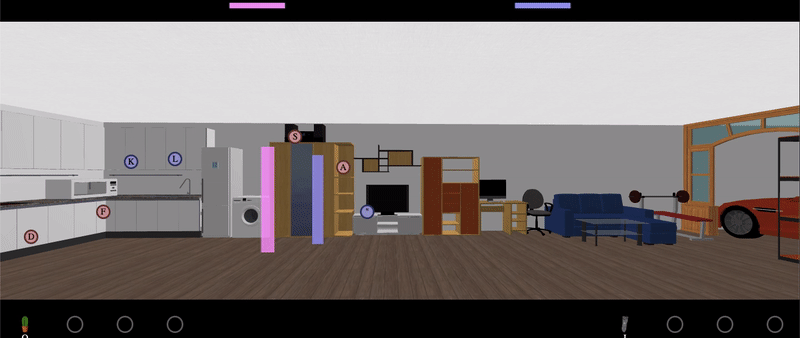

# angry-wife

Primary goal of this project is to learn Elm. The project is designed such that anybody can write their own custom UI, like demonstrated in Main.elm; while keeping the rest of the files (game logic) intact. For example: SVG based UI, Canvas based UI, WebGL based UI etc.

The game, in it's current state, requires user's imagination to feel like fun. The pink and blue pillars represent wife and husband respectively. There are in the middle of a heated argument and are ready to use household items against each other. The items that each player can use is marked with a circle with a shortcut key written on it. Pressing the key moves player to fetch the item, which is then available to use with another shortcut key that can be seen in the bottom. Using the shortcut keys listed in the bottom causes player to throw the item; which when hits the other player, in this game world, discourages the other player to continue argument. This game by no mean encourages domestic violence.

## How does game play look like

## How to run the game
Download as zip and open the index.html in your favorite browser.

## How to make changes in the game
* Download zip, or clone the project
* Install Elm
* Run elm install
* Run: `npx chokidar-cli **/*.elm -c 'elm make ./src/Main.elm --output=./dist.js'`
* Open index.html in your favorite browser
* Make changes with your favorite editor and refresh the browser
